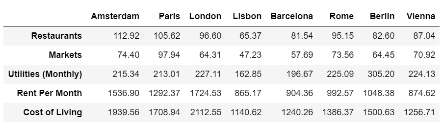

# Numbeo Web-Scraper

This folder contains a web-scraper to scrape [Numbeo](https://www.numbeo.com/cost-of-living/) for cost of living data. It will scrape all the data that Numbeo will allow you to for a given country and location (Numbeo fairly prevents scrapers, and so you won't get much if you try). It will give back all of the information that you could get for every location within a search query. 

## Usage

This scraper is built to scape Numbeo for an inputted country and location. To use it, you can simply call it from the command line as follows: 

```python 
python scrape.py   for scrapping all cost of living information
python scrape_healthcare.py     for scrapping only health care components
python scrape_pollution.py     for scrapping all pollution data
```

## API Accessible

api = API(URL, "country")

api.get_single_city("location")

---
## Applying the Numbeo Scraper
### EU Cities Cost of Living

`Author: Moises Mendes`


Using the original code and some additional processing functions, 
it is possible to retrieve general cost of living information for
cities around the world. Here the example uses European cities.

Please note that the presented values are an **estimated cost of living** 
based on a few categories from the Numbeo website (that don't include
many things and sometimes show one item value for comparison). Therefore, 
it can serve as a **means of comparison** between average city cost, but 
not as a reliable source of monthly cost of living. (For details of 
specific items in each category, visit the 
[Numbeo website](https://www.numbeo.com/cost-of-living/).)

The code that generates the image bellow is available as a Jupyter 
notebook at `notebooks/EU Cities Cost of Living Comparison.ipynb`. 
An exploratory notebook is also available in the same `notebooks` folder.


